# SudokuSolver-OpenCV
A realtime sudoku solver built using Python, Keras and OpenCV

# How it works?

## Broadly there are 4 steps involved in this

* Detecting and Extracting the Sudoku Puzzle from the camera input.
* Identifying the digits in the localized Sudoku Puzzle.
* Solving the identified sudoku puzzle.
* Projecting the solution back on to the original input frame.

<strong>Note: For most of the image processing involved I have worked with grayscale images and also the extracted digits and the images on which the CNN is trained on are single channeled grayscale images.</strong>

# A) Detecting and extracting only the sudoku puzzle from the camera input

* We first capture the input from the camera and morph the input (This makes it a lot easier to apply any kind of image processing techniques)
* We then find the contours in the image using OpenCV's `findContour()`.
* The Sudoku puzzle as we know is an 9x9 Grid (A square, if not most prolly a rectangle) so it forms a closed contour and given ideal background conditions this contour should be the one with the largest area.
* We make use of this fact to extract and localize only the sudoku puzzle from the whole input.

## The Source image

  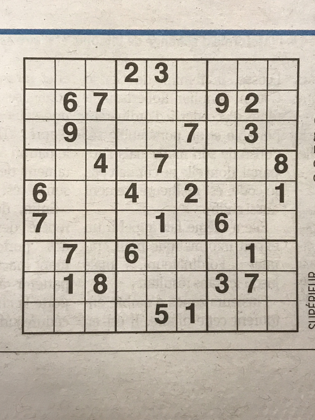

The image shown, which I found on reddit (A meme called accidental swastika :joy:) contains a sudoku grid on a paper. This is the original 3 channeled RGB source image and this will be serving as an example, where we will look at how each step is carried out on this particular image.

                 
## Morphed image

  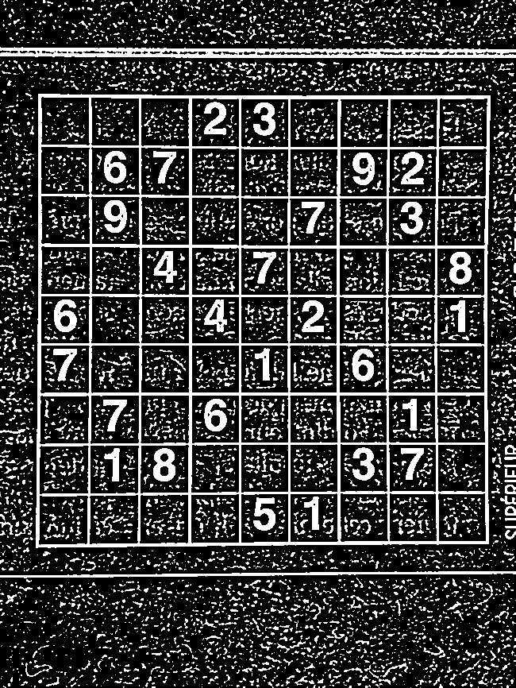

This is the image obtained after applying some morphological transformations using <code>morph_image()</code>. Specifically for this task I have first converted the image from color to black and white and then performed Gaussian Blur to smooth the image and then applied a threshold operation. The end result of these operations is as shown in the above sample.

### NOTE: The source image is of a very high resolution and when resizing it as it can be seen much noise is expected in the output. This noise is causes many disturbances for the NN model used for predicting the digits but while capturing the input from (say) a webcam such high amount of noise is not present.

## Contours

  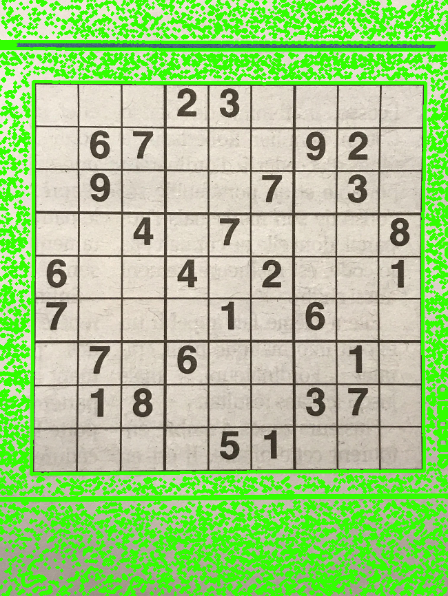

We then find out all the contours in the image using OpenCV's <code>findContours()</code> method. The above image shows all the identified contours in the image. Next we need to extract the region of image that contains the largest contour area.

                 
## Largest contour and localizing the puzzle

### Largest contour in the image

  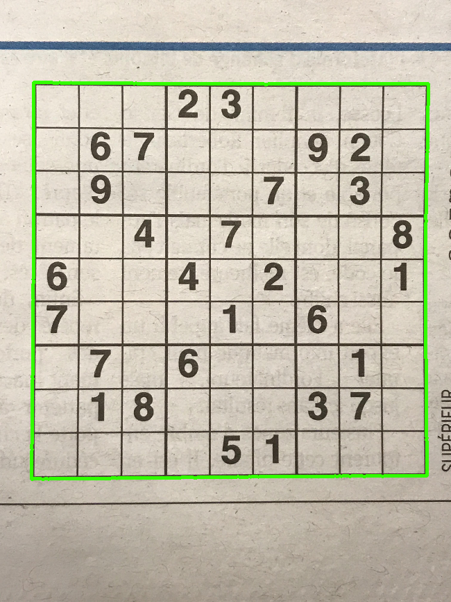

So we now pick the contour with the largest area in other words this contour is the one that contains only the sudoku puzzle grid.

### Corners of the contour

  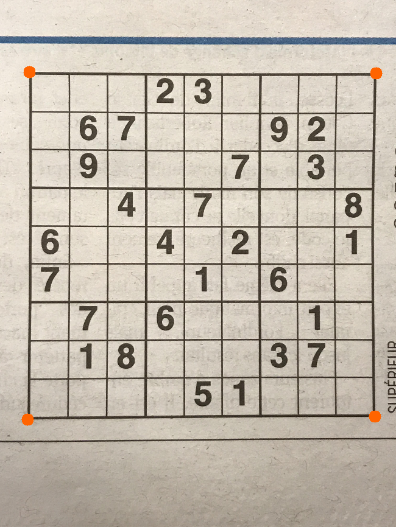

Now that we have found the contour enclosing the sudoku puzzle, the next task is to localize only the puzzle from the camera input. Just extracting the ROI is fine but in many cases the orientation of the puzzle isn't guaranteed to be straight(I very well might hold the paper in an inclined manner and even then we would want our program to solve the puzzle). So now we begin with identifying the four corners that enclose the sudoku grid or in other terms the points that form the contour (square or most prolly a rectangle)

# B) Identifying the digits in the localized Sudoku Puzzle.

  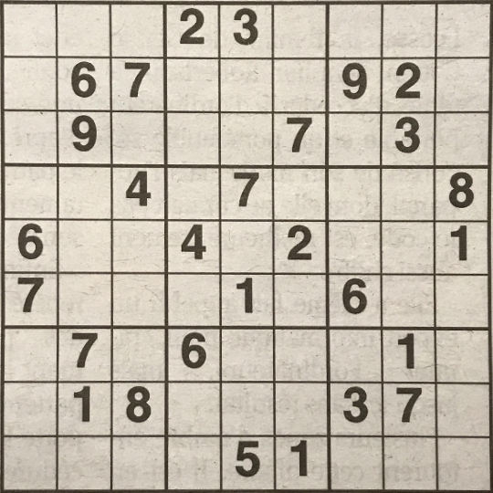

Now that we have the points that enclose this contour we use OpenCV's <code>getPerspectiveTransform()</code> <code>warpPerspective()</code> to warp and isolate the sudoku grid from rest of the image.

## Extracting digits from the puzzle

### Locating the boxes

  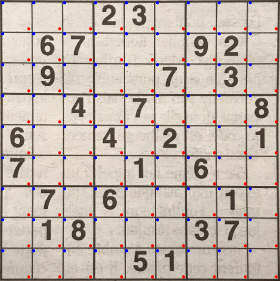

Now that we have localized the sudoku image extracting digits from the sudoku is an easy task. Since we know the dimensions of the puzzle (say) [width, height] the dimensions of each of the box would approximately be equal to [width/9, height/9] and by simple geometry we can map out the endpoints of each of the box in the puzzle.
 
<strong>NOTE: In the above image the blue points correspond to the top left of a box and the red points correspond to the bottom right of a box which can be used to extract the digits</strong>

### Extracting and preprocessing the digits

Now using a bit of image processing we remove the noise around the image and the images are resized to 40x40 and the digits are centralized, this is to ensure that the data on which the CNN is trained and the images it's going to predict are similar.

  <h3 style="padding-bottom:2em">Before Preprocessing</h3>
  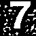

  <h3 style="padding-bottom:2em">Preprocessed and Resized</h3>
  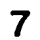

In a similar way we extract digits from each of the boxes and reject(Fill with 0) in the boxes where there is no digit and all these identified digits are sent to the CNN model and the digit is predicted. After we have identified all the digits sucessfully now it is time to solve the sudoku puzzle.

# C) Solving the identified sudoku puzzle.

### Unsolved Grid (Identified Grid)

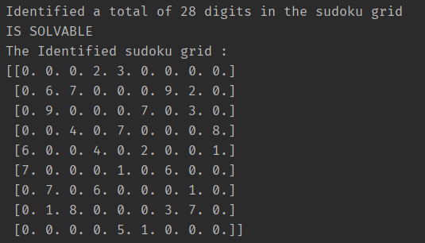

#### I've used numpy's ndarray for storing and solving the sudoku puzzle as shown above.

#### I have used a simple bactracking based approach which is a modified implementation of what I found at <a href="https://www.youtube.com/watch?v=G_UYXzGuqvM">Computerphile's Solving a Sudoku using recursion</a>

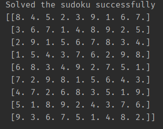

# D) Projecting the solution back on to the original input frame.

##### Since we already have the locations of each of the box in the grid and also the identified grid (which I used as a mask to determine which positions contain an image) we can just use OpenCV's `putText()` method and put the solution onto the localized sudoku image and using inverse_warp we can stitch this back onto the original input image.

## The Solved image
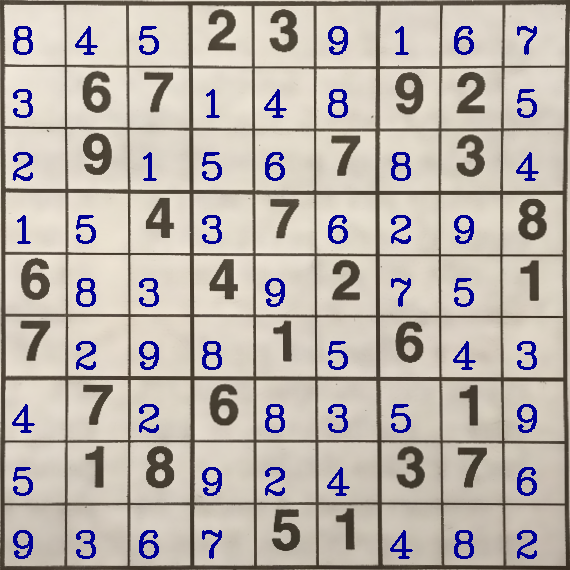
